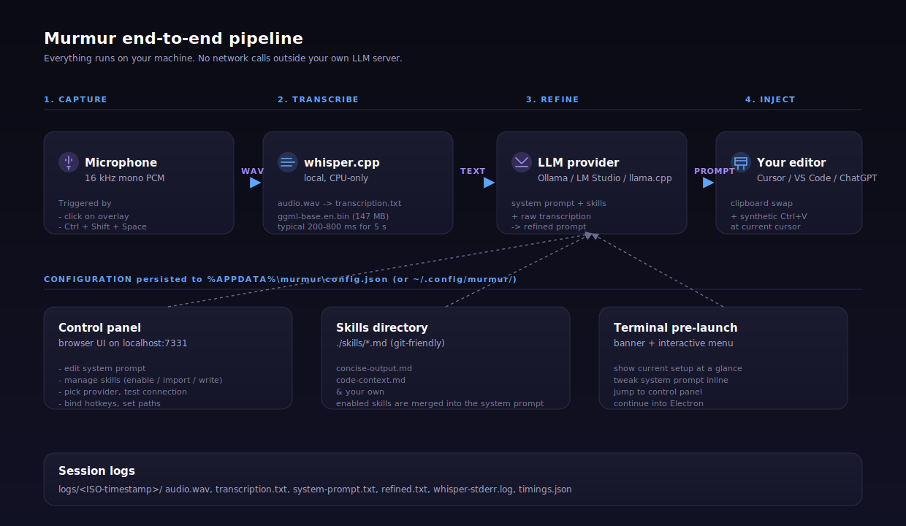

<p align="center">
  
</p>

<p align="center">
  <a href="https://www.npmjs.com/package/@mouadja/murmur"></a>
  <a href="https://www.npmjs.com/package/@mouadja/murmur"></a>
  <a href="https://github.com/mouadja02/murmur/actions/workflows/ci.yml"></a>
  <a href="https://github.com/mouadja02/murmur/releases"></a>
  
  
  
</p>

---

## What is Murmur?

Murmur is a tiny floating button that sits on top of your desktop. You **tap it and talk**, and a few seconds later a clean, structured prompt appears exactly where your cursor is — in Cursor, ChatGPT, a terminal, a GitHub issue, anywhere.

Under the hood, your voice is transcribed **on your own machine** (with `whisper.cpp`), then rewritten into a high-quality prompt by **your own local LLM** (Ollama, LM Studio, llama.cpp server — your choice). Nothing ever leaves your computer.

Think of it as:

> "I know what I want, I just don't want to type it."

---

## See it in 30 seconds

1. **A small pill floats on your desktop.** Always on top. Drag it anywhere.
2. **Click it (or hold `Ctrl+Shift+Space`) and talk.** A soundbar reacts while you speak.
3. **Release.** The pill walks through *recording → transcribing → refining → injecting → done*.
4. **The refined prompt appears at your cursor.** Your original clipboard is restored a moment later.

You stay in flow. No context switch. No "open app, paste, reformat, paste again."

---

## Get started

You need **Node.js 20+**, a working microphone, and a local LLM server running somewhere (see the table further down if you're not sure which). Windows 10/11, macOS 12+, and modern Linux (X11; Wayland via Xwayland) are all supported.

### Option A — just try it (no clone, ~15 s)

```bash
npx @mouadja/murmur
```

That pulls the published package from npm, runs the pre-launch banner, and spins up the overlay. On the first run it will also prompt you to fetch `whisper.cpp`:

```bash
# Windows: downloads whisper-cli.exe + ggml-base.en.bin into ./bin/whisper/
npx @mouadja/murmur setup:whisper

# macOS / Linux: downloads ggml-base.en.bin into ./models/
# and prints the exact command to install whisper-cli via your package manager
npx @mouadja/murmur setup:whisper
```

### Option B — install globally

```bash
npm install -g @mouadja/murmur
murmur
```

After this, `murmur` is on your `PATH` and you can launch it from any terminal.

### Option C — hack on the source

```bash
git clone https://github.com/mouadja02/murmur.git
cd murmur
pnpm install
pnpm setup:whisper
pnpm dev
```

All three options drop you in the same place. The first run creates a config file at `%APPDATA%\murmur\config.json` (Windows), `~/Library/Application Support/murmur/config.json` (macOS), or `~/.config/murmur/config.json` (Linux), with sensible defaults, and prints a banner in the terminal. Grab the **control panel URL** it shows (default `http://localhost:7331`) to tweak things in a browser without touching JSON.

> **Linux runtime deps.** The overlay's global hotkeys + paste injection use `uiohook-napi` + `@nut-tree-fork/nut-js`, which link against X11 at runtime. On Ubuntu/Debian:
>
> ```bash
> sudo apt-get install -y libx11-6 libxtst6 libxkbcommon0
> ```
>
> Most desktops ship these by default; install them if the overlay fails to boot with an `Error loading shared library` message.

> If you don't have a local LLM yet, the fastest path is:
> ```powershell
> # Install Ollama from https://ollama.com, then:
> ollama pull qwen3:4b
> ```
> Murmur targets `qwen3:4b` on Ollama by default.

---

## How it works

<p align="center">
  
</p>

Four stages, strictly local:

| Stage | What happens |
| --- | --- |
| **Capture** | The overlay records 16 kHz mono PCM while you hold the hotkey (or between two clicks). |
| **Transcribe** | `whisper.cpp` turns the WAV into text on your CPU. |
| **Refine** | Your local LLM rewrites the transcription into a structured prompt using your active system prompt + enabled skills. |
| **Inject** | Murmur copies the refined text, fires `Ctrl+V` at your current cursor, then restores whatever was on your clipboard before. |

Every session gets a timestamped folder under `logs/` with the WAV, the raw transcription, the exact prompt sent to the LLM, and the refined output — so you can debug anything after the fact.

---

## Features at a glance

- **One-click or push-to-talk** — click the pill, or hold `Ctrl+Shift+Space`.
- **Drag anywhere** — pill position is saved and survives restart.
- **Toggle hotkey** — `Ctrl+Shift+H` hides / shows the overlay from any app.
- **Right-click menu** — open the control panel, reset position, quit.
- **Control panel on localhost** — browser-based UI for system prompt, skills, provider, hotkeys, and paths. Changes hot-reload without restarting.
- **Skills as Markdown** — drop `.md` files into `./skills/`, toggle them on/off from the panel. Version-controllable, shareable.
- **Terminal pre-launch banner** — every `pnpm dev` shows your current setup and offers a one-key menu to edit the prompt or jump to the panel.
- **Provider agnostic** — Ollama native API, any OpenAI-compatible server (LM Studio, llama.cpp server, vLLM, Jan, KoboldCpp, oobabooga, …).
- **100 % local** — no telemetry, no outbound network calls except to the LLM server you configured.
- **Session logs** — every run writes audio + timings + prompts to `logs/<timestamp>/` for full traceability.

---

## The control panel

Open it from the overlay (right-click → **Open control panel**), from the pre-launch terminal menu, or by pasting `http://localhost:7331` into your browser.

| Tab | What you can do |
| --- | --- |
| **System prompt** | Live-edit the active prompt and see the composed preview (base + enabled skills). |
| **Skills** | Add, edit, rename, delete skills. One click to enable/disable each. |
| **Provider** | Switch provider, base URL, model, API key. One-click presets for Ollama / LM Studio / llama.cpp. **Test connection** button reports latency. |
| **Whisper** | Point to a different `whisper-cli` binary (or `whisper-cli.exe` on Windows) or `.bin` model. |
| **Hotkeys** | Bind push-to-talk and toggle combos with live validation. |
| **Paths** | Logs dir, skills dir, and the resolved config file path. |

Every save writes back to `%APPDATA%\murmur\config.json` atomically and hot-reloads in the running app — no restart needed.

---

## Skills

Skills are small Markdown files that layer onto your base system prompt when enabled. Perfect for *"always talk like a senior Go reviewer"*, *"bias toward concise output"*, or project-specific vocabulary.

Each skill lives at `skills/<id>.md`:

```markdown
---
id: concise-output
name: Concise output
description: Trim filler, keep the prompt to the point.
---

Prefer terse, structured prompts. Use bullets for constraints.
No hedging, no apologies, no restating the question.
```

You can author them in your editor (they're git-friendly) or in the control panel's **Skills** tab. Enabled skills are concatenated under an `## Active skills` header in the prompt sent to the LLM.

---

## LLM providers

Pick one. The `openai-compat` provider covers practically every local server that speaks the OpenAI chat-completions dialect.

| Provider | `--provider` | Default base URL | Known-good servers |
| --- | --- | --- | --- |
| **Ollama (native)** | `ollama` | `http://localhost:11434` | Ollama. Uses `/api/generate` with `think:false`. |
| **OpenAI-compatible** | `openai-compat` | `http://localhost:1234/v1` | LM Studio, llama.cpp server, vLLM, Jan, KoboldCpp, oobabooga, Ollama's own `/v1` endpoint. |

> `openai-compat` expects the **full** base URL including `/v1` — Murmur will not append it for you.

### Quick recipes

```powershell
# Ollama (default)
ollama pull qwen3:4b
pnpm dev

# LM Studio — load a model, click "Start Server"
pnpm dev --provider openai-compat --base-url http://localhost:1234/v1 --model qwen/qwen3-1.7b

# llama.cpp server
# llama-server -m models/qwen3-4b.Q4_K_M.gguf --port 8080
pnpm dev --provider openai-compat --base-url http://localhost:8080/v1 --model qwen3

# Generic, with an API key
pnpm dev --provider openai-compat --base-url http://localhost:5000/v1 --model my-model --api-key sk-xxx
```

---

## Overlay cheatsheet

| Action | Behaviour |
| --- | --- |
| **Click** the pill | Toggles recording (start / stop) |
| **Hold** `Ctrl+Shift+Space` | Push-to-talk: records while held, processes on release |
| **Tap** `Ctrl+Shift+H` | Show / hide the overlay from anywhere |
| **Drag** the pill | Moves it; the new position survives restart |
| **Right-click** the pill | Context menu: open control panel · hide · reset position · quit |
| **Hover** the pill | Tooltip with provider · model · both hotkeys · hints |

### From the terminal

After Murmur finishes bootstrapping it prints a compact status block in the terminal with **clickable links** (thanks to OSC-8 hyperlinks — works in Windows Terminal, iTerm2, VS Code, Alacritty, WezTerm, Kitty and most modern emulators):

```
  o murmur is ready
    Overlay   show / hide / toggle
    Panel     http://localhost:7331
    Hotkeys   Ctrl+Shift+Space (push-to-talk) / Ctrl+Shift+H (toggle)
```

- **Overlay links** use Murmur's custom `murmur://show`, `murmur://hide`, `murmur://toggle` URL scheme. Clicking them (Ctrl-click in some terminals) routes the action straight into the already-running Murmur instance via Electron's single-instance lock — **no browser tab opens**. Registration happens automatically the first time Murmur starts; on Linux a `.desktop` file is written to `~/.local/share/applications/`.
- **Panel link** is a regular `http://` URL and opens the control panel in your default browser.

The same overlay controls live in the **Overlay** widget at the top-right of the browser panel, with a live status pill (visible / hidden).

---

## Session logs

Every invocation writes to `logs/<ISO-timestamp>/`:

```
logs/2026-04-17T19-28-01-234Z/
├── audio.wav             # exactly what Whisper received
├── transcription.txt     # Whisper's raw output
├── system-prompt.txt     # base + enabled skills, as sent
├── refined.txt           # what got pasted
├── whisper-stderr.log
└── timings.json          # audioDurationMs, transcribeMs, refineMs, injectMs, totalMs
```

`timings.json` is your ground truth for end-to-end latency — see **Latency** below.

---

## Power-user reference

<details>
<summary><strong>CLI flags</strong></summary>

CLI flags trump the config file. Append them after `pnpm dev`:

```powershell
pnpm dev --provider openai-compat --base-url http://localhost:1234/v1 --model qwen/qwen3-1.7b
```

| Flag | Purpose |
| --- | --- |
| `--provider <ollama \| openai-compat>` | Provider implementation |
| `--base-url <url>` | Provider HTTP base URL |
| `--model <id>` | Model identifier on the provider |
| `--api-key <key>` | Bearer token (`openai-compat` only) |
| `--temperature <float>` | Sampling temperature (default `0.2`) |
| `--whisper-cli <path>` | Path or `PATH`-resolvable name of `whisper-cli` (`whisper-cli.exe` on Windows) |
| `--whisper-model <path>` | Path to a `ggml-*.bin` model file |
| `--hotkey <combo>` | Push-to-talk combo (default `Ctrl+Shift+Space`) |
| `--toggle-hotkey <combo>` | Show/hide combo (default `Ctrl+Shift+H`) |
| `--logs-dir <path>` | Per-session logs directory |
| `--skills-dir <path>` | Skill `.md` files directory (default `./skills`) |
| `--enabled-skills <a,b,c>` | Comma-separated skill IDs to force-enable for this launch |
| `--system-prompt <text>` | Override the active system prompt (skills still layer on top) |
| `--control-panel-port <n>` | Control-panel port (default `7331`; `0` = pick free) |
| `--overlay-anchor <bottom-center \| bottom-right \| top-right \| free>` | Docking corner |
| `--overlay-offset-x <px>` / `--overlay-offset-y <px>` | Offset from the anchor |
| `--overlay-position <x,y>` | Force a free-floating position |
| `--config <path>` | Override the config file location |
| `--print-config` | Print resolved config and exit |
| `-h`, `--help` | Show help and exit |

Combo strings parse from `Ctrl+Shift+Space` form. Modifiers: `Ctrl`/`Control`, `Shift`, `Alt`/`Option`, `Cmd`/`Win`/`Meta`/`Super`. Keys: `A`–`Z`, digits, `Space`, `Enter`, `Tab`, `Escape`, `F1`–`F12`, and friends.

</details>

<details>
<summary><strong>Config file schema</strong></summary>

Auto-created on first run, under the OS user-data dir:

- Windows: `%APPDATA%\murmur\config.json`
- macOS: `~/Library/Application Support/murmur/config.json`
- Linux: `~/.config/murmur/config.json` (respects `$XDG_CONFIG_HOME`)

```json
{
  "provider": "ollama",
  "baseUrl": "http://localhost:11434",
  "model": "qwen3:4b",
  "apiKey": null,
  "temperature": 0.2,
  "whisperCliPath": "whisper-cli",
  "whisperModelPath": "./models/ggml-base.en.bin",
  "sampleRate": 16000,
  "hotkeyCombo": "Ctrl+Shift+Space",
  "toggleHotkeyCombo": "Ctrl+Shift+H",
  "clipboardRestoreDelayMs": 150,
  "overlay": {
    "anchor": "bottom-center",
    "offsetX": 0,
    "offsetY": 24,
    "position": null
  },
  "logsDir": "./logs",
  "skillsDir": "./skills",
  "systemPrompt": "You refine a raw voice transcription …",
  "enabledSkills": [],
  "controlPanelPort": 7331
}
```

Any field can be omitted; missing fields fall through to defaults. `overlay.position` is written the first time you drag the pill — at that point `overlay.anchor` flips to `"free"` so the new spot survives restarts. Right-click → **Reset position** clears it.

</details>

<details>
<summary><strong>Environment variables (legacy, dev-only)</strong></summary>

Still supported for development workflows:

| Variable | Maps to |
| --- | --- |
| `LLM_PROVIDER` | `provider` |
| `LLM_BASE_URL` (or `OLLAMA_URL`) | `baseUrl` |
| `LLM_MODEL` | `model` |
| `LLM_API_KEY` | `apiKey` |
| `LLM_TEMPERATURE` | `temperature` |
| `WHISPER_CLI_PATH` | `whisperCliPath` |
| `WHISPER_MODEL_PATH` | `whisperModelPath` |
| `MURMUR_HOTKEY` | `hotkeyCombo` |
| `MURMUR_TOGGLE_HOTKEY` | `toggleHotkeyCombo` |
| `MURMUR_LOGS_DIR` | `logsDir` |

</details>

<details>
<summary><strong>Latency targets</strong></summary>

From `architecture.md` §3.5 (mid-tier PC, small prompts):

| Stage | Target |
| --- | --- |
| Hotkey → recording start | < 50 ms |
| STT (~5 s of speech) | 200–400 ms (Parakeet) — `whisper-base.en` is slower on CPU |
| LLM refinement (~200 tok out, `qwen3:4b`) | 800–1500 ms |
| Injection | < 100 ms |

Typical short utterance ("refactor this function to use async await") on a mid-tier laptop: **~2–4 s end-to-end**, dominated by `refineMs`. Cold-start on the first request is markedly worse because the model hasn't been loaded into RAM/VRAM yet.

</details>

---

## Contributing

### Scripts

| Command | What it does |
| --- | --- |
| `pnpm dev` | Clean + compile + launch Electron (with the pre-launch CLI) |
| `pnpm build` | Clean + compile only (no launch) |
| `pnpm check` | `tsc --noEmit` + `biome check .` |
| `pnpm format` | `biome format --write .` |
| `pnpm test` | Run the Node built-in test suite against `dist/` |
| `pnpm test:ci` | `pnpm build && pnpm test` |
| `pnpm clean` | Remove `dist/` |
| `pnpm setup:whisper` | Windows: download `whisper-cli.exe` + `ggml-base.en.bin`. macOS/Linux: download the model + print install hints for `whisper-cli`. |

### CI

Every push and every PR to `main` runs the **CI** workflow (`.github/workflows/ci.yml`) on both Ubuntu and Windows:

1. `pnpm install --frozen-lockfile`
2. `pnpm check` (typecheck + lint)
3. `pnpm build`
4. `pnpm test`

A red check blocks merge. Keep it green.

### Releases

Releases are driven by git tags. To cut a new version:

```powershell
# 1. Bump the version in package.json
pnpm version patch        # or minor / major

# 2. Push the commit + tag
git push origin main --follow-tags
```

The **Release** workflow (`.github/workflows/release.yml`) then runs two jobs in sequence:

1. **GitHub Release (Windows bundle)** — checks out the tag, verifies `package.json` matches the tag, runs `pnpm check` + `pnpm test:ci`, builds, zips `bin/ + dist/ + scripts/ + skills/ + docs/ + package.json + lockfile + README + LICENSE + logo` into `murmur-v<version>-win-x64.zip`, and attaches it to an auto-generated GitHub Release.
2. **npm publish** — on an Ubuntu runner: re-installs, rebuilds, then runs `pnpm publish --access public` using the `NPM_TOKEN` secret. If the token isn't configured the job logs a warning and exits cleanly, so the GitHub Release still ships.

You can also trigger the workflow manually from the Actions tab with a `tag` input (useful for re-releases).

#### Setting up `NPM_TOKEN` (one-time)

1. Generate an **Automation** token on [npmjs.com → Access Tokens](https://www.npmjs.com/settings/~/tokens) with *Publish* scope (2FA-exempt).
2. Add it to the GitHub repo at **Settings → Secrets and variables → Actions → New repository secret**, name it `NPM_TOKEN`.
3. The next tagged push will publish both a GitHub Release and the npm package.

Files shipped to npm are whitelisted in `package.json#files` — run `pnpm pack` locally to inspect exactly what the tarball will contain before publishing.

### Dependabot

`.github/dependabot.yml` opens weekly npm PRs (split into `dev-dependencies` and `runtime-dependencies` groups) and monthly `github-actions` PRs.

---

## Known rough edges

1. **No streaming anywhere.** Each stage is strictly sequential. Streaming STT + streaming LLM + streaming injection is the biggest pending latency win.
2. **Model cold-start dominates first-run latency.** Pre-warming the model on app start (`keep_alive`) is queued.
3. **Paste-based injection only**, no per-target typing fallback.
4. **No VAD / silence trimming.** Trailing "uhh" and dead air get transcribed and fed to the LLM.
5. **Renderer uses the deprecated `ScriptProcessorNode`.** Move to `AudioWorklet` before any non-spike build.
6. **No tray icon.** Hide / show is handled by the toggle hotkey and the right-click context menu; restart re-shows the overlay if you ever lose the toggle binding. A tray fallback is queued.
7. **Off-screen drag is auto-clamped on relaunch.** The saved free position is clamped to the nearest connected display's work area on launch, so a saved position from a now-disconnected monitor doesn't strand the overlay.
8. **Single utterance at a time.** Concurrent recordings are dropped; queueing is not implemented.

---

## License

[MIT](./LICENSE) © Mouad Ja. Pre-1.0; APIs and config may still change.
