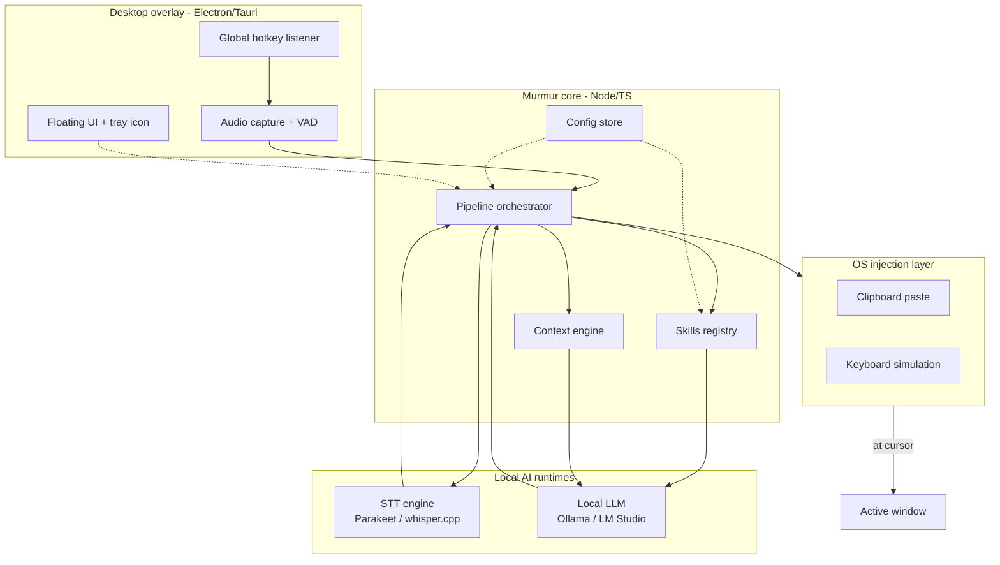

# Murmur — Voice-First Prompt Engineering for Vibe Coders

*Architecture, branding, and implementation blueprint*
*Draft v0.1 — April 2026*

---

## 1. What we're actually building

A desktop overlay that sits on top of everything, listens when you tap a hotkey, transcribes your voice locally, runs the transcription through a **local LLM with a chosen prompt-engineering "skill"**, and pastes the refined prompt wherever your cursor is blinking — Cursor, Claude.ai, ChatGPT, VS Code, a terminal, anywhere.

The core idea is not *voice-to-text*. It's **voice-to-*good-prompt***. The raw transcription is an intermediate artifact; the output is a prompt that's been restructured according to prompt-engineering best practices (role, context, constraints, examples, output format), with the user's ambient context (active app, project) folded in.

All processing is local. No audio, no transcription, no prompt ever leaves the machine.

## 2. Why this exists (and how it's different)

The market already has voice dictation tools that paste at the cursor:

| Tool | Stack | Differentiator |
|---|---|---|
| **OpenWhispr** | Electron, React | Broadest model support, meeting transcription |
| **Handy** | Tauri, Rust | Most popular (HN hits), most forkable, multi-model |
| **VoiceInk** | Native Swift (macOS only) | Context-aware per-app formatting |
| **Whispering** | Web + extension | Voice-activated session mode, YC-backed |
| **MacWhisper** | Native Swift | Polished paid product with Parakeet support |

All of these solve "dictation." None of them treat the transcription as raw input to a **prompt-engineering pipeline**. That's the wedge.

**Our three differentiators:**

1. **Skill-based prompt refinement.** Every recording runs through one of many installable "skills" (using the openclaw/Anthropic `SKILL.md` format) — `code-prompt-engineer`, `architecture-request`, `bug-report-writer`, `slack-reply`, etc. Skills are community-extensible and compatible with the already-huge claude-skills ecosystem.
2. **Vibe-coding native.** Auto-detects Cursor, Claude Code, Windsurf, Aider, Claude.ai, ChatGPT, etc. and picks the right skill + formatting per target.
3. **Project context injection.** You tell Murmur once what you're working on (path, tech stack, conventions), and every refined prompt gets grounded in that context without you re-saying it every time.

## 3. Branding

### Name shortlist (with rationale)

| Name | Vibe | Why | Domain intuition |
|---|---|---|---|
| **Murmur** *(lead pick)* | Quiet, elegant, professional | Whisper-adjacent without trademark collision with OpenAI Whisper; evokes low-effort, close-to-you speech | `murmur.dev`, `murmurhq.com`, `getmurmur.app` |
| **Riff** | Playful, developer-native | "Riffing on a prompt" = exactly what voice-first coding feels like; fits vibe-coding culture perfectly | `riff.dev`, `riffcli.com` |
| **Scrybe** | Crafted, unique | Scribe reimagined; phonetic "cry" nods to voice; trademarks clean | `scrybe.app`, `scrybe.sh` |
| **Cadence** | Sophisticated | Rhythm of speech + flow of code; suggests structured output | `cadence.dev` (likely taken — verify) |
| **Cue** | Minimal, pure | You are cueing the AI; three letters; extremely brandable | `cue.sh` (likely taken), `cueapp.dev` |

**My pick: Murmur.** It reads as a real product, logo is obvious, name is short enough to type as a CLI (`murmur`), and the `.dev` space is underclaimed. The rest of this doc uses `murmur`.

### Logo concept

```
  ╭──────╮
  │   ~  │    Wordmark: lowercase "murmur" in a rounded geometric sans
  │  ~~~ │    (Geist Mono, Instrument Serif, or Söhne).
  │   ~  │    Icon: three concentric sound waves stacked, the middle one
  ╰──────╯    offset — suggesting speech being refined/reshaped.
              Color: single-hue (deep teal #0F766E or indigo #4338CA),
              mono-friendly so it looks clean in the system tray.
```

Key constraint: must look good at **16×16px** (system tray) and **512×512px** (app icon). Avoid anything with text or fine gradients.

## 4. Product surface

```
┌─────────────────────────────────────────────────┐
│                                                 │
│              your editor / browser              │
│                                                 │
│                                                 │
│                             ┌────────────────┐  │
│                             │  ◉  0:04   ▓▓  │  │ ← recording pill
│                             │  code-prompt   │  │   (floating, draggable,
│                             └────────────────┘  │    auto-hides when idle)
│                                                 │
└─────────────────────────────────────────────────┘
                                       ▲
                                       └─ active skill
```

**Four UI states:**

1. **Idle** — tiny 24px orb near the menu bar / taskbar. Almost invisible.
2. **Recording** — pill expands, shows elapsed time, live waveform, active skill name.
3. **Processing** — pill shows spinner + "transcribing…" → "refining…".
4. **Review (optional)** — floating diff view showing raw vs. refined, one keystroke to accept or reject. Can be disabled for pure flow mode.

**Interaction modes:**

- **Push-to-talk** (hold Cmd+Shift+Space): records while held, inserts on release.
- **Toggle** (tap Cmd+Shift+Space): records until tapped again or silence timeout.
- **Voice-activated** (opt-in): VAD detects speech, auto-start/stop.

The global hotkey and mode are configurable. Default is push-to-talk because it's the least jumpy for first-time users.

## 5. Architecture

### High-level



### Request lifecycle

```
1. User presses hotkey
2. Audio capture starts (16kHz mono, in-memory ring buffer)
3. VAD trims leading/trailing silence
4. Audio → STT engine → raw transcription
5. Context engine snapshots: { active_app, window_title, project_profile, time_of_day }
6. Skill resolver picks skill:
     - Explicit user override (if selected this session), OR
     - Active-app rule match (Cursor → code-prompt-engineer), OR
     - Default skill
7. LLM refinement prompt built from:
     skill.system_prompt
     + context snapshot
     + raw transcription
     + skill.output_format
8. LLM call to Ollama (streaming)
9. Refined prompt → injection layer
10. Injection strategy:
     - Clipboard-paste (default, fastest, requires brief clipboard ownership)
     - Typing simulation (fallback for apps that block paste)
11. Optional: emit to history log for later review
```

**Target latency budget (small prompts, M2/M3 MacBook or mid-tier PC):**

| Stage | Budget |
|---|---|
| Hotkey → recording start | < 50ms |
| STT (5s of speech, Parakeet 600M) | ~200–400ms |
| LLM refinement (Qwen 3 4B, ~200 tok out) | ~800–1500ms |
| Injection | < 100ms |
| **Total wall-clock (push release → text appears)** | **~1.5–2s** |

On a modest CPU-only machine, expect 3–5s total. That's the ceiling we need to design around.

## 6. Tech stack

### Desktop shell — Electron vs. Tauri

| | Electron | Tauri |
|---|---|---|
| Bundle size | ~120 MB | ~10–20 MB |
| RAM (idle) | ~200 MB | ~50 MB |
| Language | Node/TS | Rust + TS (webview) |
| NPM-native distribution | Yes | Awkward (needs prebuilt binaries) |
| Ecosystem for audio/keyboard/tray | Mature (robotjs, nut-js, node-microphone) | Good, younger |
| Author's stack familiarity | High | Low |

**Recommendation: Electron.** Reasoning:

- You asked for NPM-first distribution. Electron publishes to npm naturally; Tauri doesn't.
- You live in Node/TS and n8n workflows. Tauri's Rust layer is a real learning investment for a side project.
- Bundle size matters less when you're shipping to developers, who already have 30 VS Code extensions installed.
- If Murmur takes off and bundle size becomes a real complaint, a Tauri rewrite is a rewrite of the shell, not the logic.

Handy (Rust/Tauri) is the ceiling on "lean." We'll be heavier, but we'll make up for it on skills and context — which is the differentiator, not bundle size.

### Core stack

| Layer | Pick | Why |
|---|---|---|
| Desktop shell | **Electron 33 + TypeScript** | NPM-native, familiar, huge ecosystem |
| UI framework | **React 19 + Tailwind 4 + shadcn/ui** | Overlay UIs are simple; this stack gets you to pretty fast |
| State / config | **zustand** + **electron-store** | Minimal, no ceremony |
| Audio capture | **Web Audio API** (inside renderer) + **node-record-lpcm16** fallback | Clean in Electron |
| VAD | **Silero VAD** (ONNX, via `onnxruntime-node`) | Industry standard, fast on CPU |
| STT | **Parakeet** via `parakeet.cpp` bindings, **whisper.cpp** as fallback | Parakeet is the fastest real option in April 2026 |
| LLM client | **`ollama-js`** + raw HTTP fetch for LM Studio | Ollama is dominant, LM Studio for power users |
| Global hotkeys | **`electron-global-shortcut`** | Built-in, reliable |
| Keyboard/clipboard injection | **`@nut-tree-fork/nut-js`** | Actively maintained, cross-platform, no native-module hell |
| Window detection | **`active-win`** | Cross-platform, stable |
| Packaging | **electron-builder** | Produces NSIS / DMG / AppImage + can publish to npm |
| CLI wrapper | **`commander`** | `murmur start`, `murmur skills install`, etc. |

### STT choice in detail

Based on April 2026 state of the art:

- **NVIDIA Parakeet TDT V3 (600M)** — best speed/accuracy ratio, 25 European languages including French (critical for Mouad), Apple Silicon Metal acceleration via `parakeet.cpp`, streaming-capable. **Primary.**
- **whisper.cpp with distil-large-v3 or large-v3-turbo** — if user needs non-European languages (Arabic, Chinese, etc.). **Fallback.**
- **Moonshine V2** — for ultra-low-resource machines. **Optional tier.**

Ship Parakeet TDT V3 as the default download (~478 MB). Offer whisper-turbo as a one-click swap. Don't bundle anything — download on first run with a progress bar.

### LLM choice in detail

You said "<4B." Good constraint — keeps latency under control. Four solid picks from the current landscape:

| Model | Size | Strengths | Best for |
|---|---|---|---|
| **Qwen 3 4B** | ~2.5 GB Q4 | Strong instruction following, multilingual, Apache 2.0 | Default recommendation |
| **Gemma 3 4B** | ~2.6 GB Q4 | Clean prose, best formatting adherence | Writing-heavy skills (email, docs) |
| **Llama 3.2 3B** | ~2 GB Q4 | Fast, stable, well-documented | Lowest-latency tier |
| **Phi-4 Mini (~3.8B)** | ~2.3 GB Q4 | Strong reasoning per parameter | Technical/code skills |

Ship `qwen3:4b` as the default. Make it a one-command swap in the settings UI. All four are one `ollama pull` away, and none require more than 8 GB RAM at Q4 quantization.

Detect Ollama availability at `http://localhost:11434/api/tags` on startup; if absent, the setup wizard walks the user through installing it (or LM Studio).

## 7. The skills system (the wedge)

### Format

Fully compatible with the Anthropic Agent Skills / openclaw skill format. A skill is a folder:

```
skills/
  built-in/
    code-prompt-engineer/
      SKILL.md
      examples/
        before.md
        after.md
    architecture-request/
      SKILL.md
    bug-report-writer/
      SKILL.md
    slack-message/
      SKILL.md
    commit-message/
      SKILL.md
    git-pr-description/
      SKILL.md
    jira-ticket/
      SKILL.md
    quick-note/
      SKILL.md
  user/
    <your custom skills here>
```

### `SKILL.md` structure

```markdown
---
name: code-prompt-engineer
description: Refines voice input into a structured coding prompt for AI coding agents
version: 0.1.0
author: murmur-core
triggers:
  apps:
    - Cursor
    - Claude
    - Windsurf
    - code
    - Code
    - chatgpt.com
  keywords:
    - function
    - class
    - bug
    - refactor
    - implement
output_max_tokens: 400
model_preference:
  - qwen3:4b
  - phi4-mini
---

# Code Prompt Engineer

You refine a raw voice transcription into a high-quality prompt for an AI
coding assistant. Apply these transformations:

1. **Structure.** Reorganize into: [Goal] → [Context] → [Constraints] → [Output format].
2. **Fix dictation artifacts.** Remove filler words ("um", "like", "you know"). Fix homophones using the project context ("react" not "wreaked" when the project is TypeScript).
3. **Expand abbreviations** using project vocabulary (e.g. "the API" → "the Stripe webhook API" if that's in the project profile).
4. **Add missing constraints** only when obvious from context (e.g. "use TypeScript" if project is TS).
5. **Never invent requirements** the user didn't state. If ambiguous, leave it ambiguous.
6. **Keep the user's voice.** Don't make it corporate.

## Output format

Return ONLY the refined prompt. No preamble. No meta-commentary. No markdown headers unless the refined prompt itself needs them.

## Examples

### Before
"uh so I need a function that like takes a user object and returns their full name but handle the case where first name or last name is missing"

### After
Write a TypeScript function `getFullName(user: User): string` that returns the user's full name. Handle missing `firstName` or `lastName` by gracefully falling back to whichever is present, or an empty string if both are missing.
```

### Shipping a curated set on day one

Start with 8–10 built-in skills. These cover ~80% of a developer's prompting surface:

1. `code-prompt-engineer` — generic coding task refinement
2. `architecture-request` — high-level design discussions
3. `bug-report-writer` — turns "it's broken and uhh…" into a reproducible bug report
4. `refactor-request` — specifically structured refactoring asks
5. `code-review-comment` — PR review comments, concise
6. `commit-message` — conventional commits format
7. `git-pr-description` — PR descriptions with summary/testing/rollout
8. `slack-message` — casual, short, no markdown
9. `quick-note` — no refinement, light cleanup only (for Obsidian, Apple Notes)
10. `jira-ticket` — structured ticket with acceptance criteria

Then allow `murmur skills install <url-or-path>` to pull community skills, and `murmur skills new` to scaffold one interactively.

**Bridge to the existing ecosystem:** the `claude-skills` / `openclaw/skills` repos are already huge. Ship a `murmur skills import-claude-skill <path>` command that adapts an existing Claude Code skill by wrapping its system prompt in Murmur's voice-input contract. Instant catalog.

### Skill selection logic

```
function selectSkill(context, userOverride, config):
    if userOverride:
        return userOverride

    for skill in orderedSkills:
        if skill.triggers.apps matches context.active_app:
            return skill

    # keyword match on first ~50 words of raw transcription
    for skill in orderedSkills:
        if any(kw in transcription for kw in skill.triggers.keywords):
            return skill

    return config.default_skill  # usually 'quick-note'
```

User override is exposed via:
- Hold `Shift` while starting recording → opens a radial skill picker.
- Voice prefix: "as a code prompt, …" → skill prefix routing (opt-in, costs a bit of latency).
- Settings: per-app default skill overrides.

## 8. Context engine

The context engine is what makes the refinement *about your actual work* instead of generic.

### Signals (all local, all opt-in per signal)

| Signal | Default | Notes |
|---|---|---|
| Active window title + app name | On | `active-win` gives this; costs nothing |
| Front-most URL in browsers | Off | Platform-specific AppleScript / UIA; privacy-sensitive |
| Selected text | Off | Shift-selection → copy-peek → restore clipboard; brittle |
| Last N clipboard items | Off | Off by default. Useful for "paste that into a bug report" flows |
| User-defined project profiles | On | The core context mechanism |

### Project profiles

A project profile is a small markdown file:

```markdown
---
name: infa2dbt
root: /home/mouad/dev/infa2dbt
languages: [python, sql]
frameworks: [langchain, langgraph, streamlit, pinecone]
conventions:
  - python 3.11, type hints always
  - dbt style guide: snake_case models, sources.yml for every external table
  - no f-strings in logging (use lazy %s)
vocabulary:
  - IICS = Informatica Intelligent Cloud Services
  - mapping = IICS mapping (the thing we're converting from)
  - consolidator = the agent that merges per-mapping outputs
---

# What I'm working on

Converting Informatica IICS JSON mapping exports into dbt projects. Multi-agent
system: iics_analyzer → dbt_generator → dbt_validator → project_consolidator.
Using Pinecone RAG for both IICS and dbt docs.
```

Profiles activate automatically when you're inside the project's root directory (detected via active window path), or manually via the tray menu. The profile's frontmatter gets compressed into a system-prompt snippet and prepended to refinement calls.

### Context injection prompt fragment

```
<context>
Active app: {{active_app}}
Window: {{window_title}}
Current project: {{project_name}} ({{languages}})
Project notes:
{{project_summary_50_tokens}}
Vocabulary (expand these if the user uses the short form):
{{project_vocabulary}}
</context>
```

Keep this under 300 tokens. A bigger context makes a small model slower and dumber.

## 9. Injection layer

Two strategies, auto-selected per target app:

### Strategy A — Clipboard paste (default)

```
1. Save current clipboard
2. Write refined prompt to clipboard
3. Send Cmd/Ctrl+V to the active window
4. Wait 100ms
5. Restore saved clipboard
```

Fast, works everywhere, 99% of the time.

**Gotchas:**
- Some password managers and secure fields block paste. Detect via window class and fall back to typing.
- Clipboard managers (Raycast, Paste.app) will log the intermediate value. Add a config flag for users who care: "Never touch clipboard — always type."

### Strategy B — Typing simulation (fallback)

Use `nut-js` to emit keystrokes directly. Slower (~30 chars/sec to stay reliable), but bypasses any paste blocking and doesn't touch the clipboard.

### Per-app overrides

```yaml
# ~/.config/murmur/injection-rules.yml
rules:
  - match: { app: "1Password" }
    strategy: skip  # never inject here, just copy silently
  - match: { app: "Terminal" }
    strategy: typing  # terminals are flaky with paste
  - match: { url_host: "claude.ai" }
    strategy: clipboard
    postpress: Enter  # auto-submit
```

The `postpress: Enter` pattern (also present in Handy's auto-submit) is huge for agent flows — you speak, it refines, it submits, you never touch the keyboard.

## 10. The three core prompts

These are the prompts Murmur itself uses internally. They matter more than any skill.

### 10.1 STT post-processing (light cleanup, same-model pass)

Optional. Skippable if the skill can tolerate raw STT output. Useful before skill-based refinement for multilingual speakers because Parakeet/Whisper sometimes over-commit to one language.

```
System:
You are a transcription cleanup pass. Fix obvious transcription errors using the
language and context below. Do NOT rephrase. Do NOT summarize. Do NOT add
content. Output only the cleaned transcription and nothing else.

Context:
Language: {{user_language}}
Active app: {{active_app}}
Technical domain vocabulary: {{project_vocabulary}}

Raw transcription:
{{raw_stt_output}}
```

### 10.2 Skill-based refinement (the main call)

```
System:
{{skill.system_prompt}}

<context>
{{context_block}}
</context>

<skill_examples>
{{skill.examples}}
</skill_examples>

<user_voice_input>
{{cleaned_transcription}}
</user_voice_input>

Output the refined prompt now. No preamble. No explanation. No markdown code
fences unless the refined prompt itself requires them.
```

Key constraints baked into every skill:
- `Output only X, no preamble` — small models love to say "Here's your refined prompt:" otherwise.
- `Do not invent requirements the user didn't state` — hallucinated requirements are the #1 failure mode.
- `Keep the user's voice` — corporate-ification of casual speech is the #2 failure mode.

### 10.3 Voice command parsing (for meta-commands)

```
System:
Classify the user's voice input as either a REFINEMENT_REQUEST or a
META_COMMAND. Meta-commands are instructions about Murmur itself, like
"switch to slack skill", "use the bug report skill", "never mind",
"cancel", "undo last". Output a single JSON object:

{ "type": "REFINEMENT_REQUEST" | "META_COMMAND",
  "command": null | "cancel" | "undo" | "switch_skill",
  "argument": null | "<skill name>" }

Input:
{{raw_stt_output}}
```

This enables "never mind, cancel" and "use the commit message skill instead" as inline voice commands. Off by default because it adds a pre-classification LLM call; power users will want it.

## 11. NPM distribution strategy

This is the trickiest part because Electron apps aren't traditionally npm-distributed.

### Chosen approach: **hybrid wrapper + prebuilt binaries**

```
@murmur/cli          → thin npm package (~500 KB)
                        - entry point: `murmur` command
                        - downloads the right Electron binary for this
                          platform on first run, caches in ~/.murmur/bin/
                        - manages lifecycle (start/stop/status/logs)
                        - runs setup wizard

@murmur/core         → the actual Electron app, published as prebuilt
                        binaries via GitHub Releases (.dmg, .exe, .AppImage)
                        - @murmur/cli fetches the right one
                        - signed + notarized on macOS
                        - signed with Authenticode on Windows

@murmur/skills-*     → individual skill packages, optional
                        e.g. @murmur/skills-code, @murmur/skills-slack
                        published independently, installed via
                        `murmur skills install @murmur/skills-code`
```

### User install flow

```bash
# Global install
npm install -g @murmur/cli

# First run — interactive wizard
murmur setup
# → detects platform
# → downloads Murmur app binary (~60 MB)
# → checks for Ollama, offers to install if missing
# → downloads default LLM (qwen3:4b, ~2.5 GB) via Ollama
# → downloads default STT model (parakeet-tdt-v3, ~478 MB)
# → creates default project profile template
# → registers global hotkey
# → launches app to tray

# Day-to-day
murmur              # launches app to tray
murmur stop         # stops the app
murmur status       # running? model loaded? hotkey registered?
murmur skills list
murmur skills install <name-or-git-url>
murmur context new  # create a new project profile
murmur logs -f      # tail logs
```

### Why this works better than publishing the Electron bundle itself to npm

- Electron bundles are 100+ MB. Publishing them to npm is rude and slow.
- GitHub Releases give you CDN + per-platform targeting for free.
- The CLI stays tiny, so `npm install -g` is instant.
- You can version the CLI and the app independently (important for hotfix velocity).

### Alternative for power users

A separate downloadable installer (DMG/MSI/AppImage) for users who don't live in npm. Both paths converge on the same `@murmur/core` binary.

## 12. Implementation roadmap

**Build it in phases. Ship something real at the end of each.**

### Phase 0 — Spike (1 weekend)
Goal: prove the pipeline works end-to-end with ugly code.

- Electron window + global hotkey
- Record to WAV on keypress, save to disk
- Shell out to `whisper.cpp` with a tiny model, read stdout
- HTTP POST to Ollama with a hardcoded prompt-engineer system prompt
- `nut-js` clipboard paste

No UI polish. No skills. Just: hotkey → speak → transcribe → refine → paste.

**Exit criterion:** you can use it to prompt Cursor, and the refined prompt is measurably better than the raw transcription. If it's not, the skill prompt needs work, not more engineering.

### Phase 1 — MVP (2–3 weekends)
Goal: you can dogfood it daily.

- Proper floating UI with recording/processing states
- In-memory audio pipeline (no disk writes)
- Silero VAD for auto-stop
- Skills registry with 3 built-in skills: `code-prompt-engineer`, `quick-note`, `commit-message`
- Basic context: active app name + window title
- Settings UI (hotkey, default skill, model selection)
- Tray icon with skill picker
- Logs window for debugging refinements

**Exit criterion:** you stop typing prompts into Cursor.

### Phase 2 — Public alpha (3–4 weeks, part-time)
Goal: someone else installs it.

- 8–10 built-in skills (full set above)
- Project profiles + auto-activation by path
- Parakeet as primary STT
- Multi-model LLM support (switch between local models in settings)
- npm distribution (`@murmur/cli` + binary fetching)
- Setup wizard
- Landing page on `murmur.dev` with a 30-second demo video
- Skill import from Claude Code / openclaw skills repos

**Exit criterion:** 10 external users, zero support tickets about the install.

### Phase 3 — Polish (ongoing)
Goal: something you're proud to put on Hacker News.

- Per-app injection rules
- Voice meta-commands ("use the slack skill")
- Skill marketplace (even just a curated list)
- Cross-platform signing/notarization
- Skill SDK (`murmur skills new`)
- Telemetry *off by default*, crash reports *opt-in*
- Accessibility pass (VoiceOver, NVDA compatibility)
- Localized UI (start with EN + FR given your audience)

## 13. Security & privacy posture

This is a differentiator, not a compliance checkbox.

- **No network calls by default.** The only outbound requests are: (1) app update checks (off in settings), (2) skill installs from explicit URLs, (3) Ollama on `localhost`. Nothing else.
- **Transcriptions and refined prompts are never persisted** unless the user opts into the history feature. Even then, stored locally only, encrypted with OS keychain.
- **Never log audio.** Period. Not even for debugging.
- **Opt-in telemetry only,** and it contains zero content — only anonymous usage events (which skill was invoked, which model, latency buckets). Publish the exact payload format.
- **Reproducible builds.** The `@murmur/core` binary is built in CI from a public commit SHA. Users can verify.
- **Clear-text config.** All configs are human-readable YAML/JSON in `~/.config/murmur/`. Respect the user's right to inspect and port.

Put a one-paragraph privacy statement on the landing page that a skeptical dev actually believes. Then live up to it.

## 14. What could go wrong

Worth naming the real risks up front:

1. **Small models aren't great at instruction following.** A 4B model will occasionally ignore "no preamble" and say "Here's your refined prompt:". Mitigation: few-shot in every skill, post-process to strip common preambles as a belt-and-suspenders measure, let users pick 7B models if they have the RAM.
2. **Latency compounds.** STT + LLM + injection > 3s feels sluggish. Mitigation: stream STT + LLM, start typing injection as soon as the first LLM tokens arrive.
3. **Platform-specific injection flakiness.** Wayland vs X11 on Linux, macOS accessibility permissions, Windows UAC — each has failure modes. Mitigation: test matrix, fall back to clipboard + notify-user-to-paste if automation fails.
4. **Skill sprawl.** Too many skills → bad default selection → users give up. Mitigation: ship 10, not 50. Let the community do the long tail.
5. **Fighting the existing dictation tools.** Don't try to beat Handy at dictation. Beat Handy at *prompting*. Every marketing sentence and demo video should emphasize "refined prompt", not "voice input."

## 15. References and further reading

### Ecosystem landscape (April 2026)

- **OpenWhispr** — https://github.com/OpenWhispr/openwhispr — closest reference for architecture (Electron, whisper.cpp, sherpa-onnx)
- **Handy** — Tauri-based, multi-model STT, the tool to watch
- **VoiceInk** — per-app context formatting patterns worth stealing
- **MacWhisper** — polished commercial reference for UX
- **Whispering** — voice-activated session mode pattern

### Skills & prompt engineering

- **alirezarezvani/claude-skills** — https://github.com/alirezarezvani/claude-skills — the 232+ skill library, format reference, direct import target
- **openclaw/skills** — https://github.com/openclaw/skills — archived clawhub.com skills, second source of skills
- **Anthropic Agent Skills guide** — https://docs.claude.com/en/api/skills-guide — canonical SKILL.md format
- **Anthropic engineering blog on agent skills** — https://www.anthropic.com/engineering/equipping-agents-for-the-real-world-with-agent-skills

### Local STT

- **parakeet.cpp** (C++ Parakeet runtime, Metal on Apple Silicon) — fastest production option
- **whisper.cpp** — https://github.com/ggerganov/whisper.cpp — universal fallback
- **faster-whisper** — https://github.com/SYSTRAN/faster-whisper — CTranslate2 backend if you want Python sidecar
- **Silero VAD** — https://github.com/snakers4/silero-vad — voice activity detection
- **Hugging Face Open ASR Leaderboard** — benchmark reference

### Local LLM hosting

- **Ollama** — https://ollama.com — primary target
- **LM Studio** — secondary target (power users)
- **Qwen 3 / 3.5 family** — Apache 2.0, current best small-model family
- **Gemma 3 family** — Google's small-model line, great for clean output

### Electron & distribution

- **electron-builder** — https://www.electron.build/ — packaging
- **`@nut-tree-fork/nut-js`** — cross-platform keyboard/mouse/clipboard
- **`active-win`** — cross-platform active window info
- **electron-store** — persistent config
- **`node-record-lpcm16`** or Web Audio API via BrowserWindow — audio capture

### Developer dictation prior art (for UX studies)

- Simon Willison's whisper notes — https://simonwillison.net/tags/whisper/
- CJ Pais's Handy origin story (broken finger → needed extensible dictation)